-> # Benötigt ==Obsidian Charts== Erweiterung
## Bar
```chart
type: bar
labels: [Monday, Tuesday, Wednesday, Thrusday, Friday, Saturday, Sunday, "next Week", "next Month" ]
series:
    - title: Title 1 
    - data: [ 1, 2, 3, 4, 5, 6, 7, 9 ]
    - title: Title 2
    - data: [ 5, 3, 2, 1, 0, -1, -2, -3]
```

## Line
```chart
type: line
labels: [Monday, Tuesday, Wednesday, Thrusday, Friday, Saturday, Sunday, "next Week", "next Month" ]
series:
    - title: Title 1 
    - data: [ 1, 2, 3, 4, 5, 6, 7, 9 ]
    - title: Title 2
    - data: [ 5, 3, 2, 1, 0, -1, -2, -3]
```

## Radar
```chart
type: radar
labels: [Monday, Tuesday, Wednesday, Thrusday, Friday, Saturday, Sunday, "next Week", "next Month" ]
series:
    - title: Title 1 
    - data: [ 1, 2, 3, 4, 5, 6, 7, 9 ]
    - title: Title 2
    - data: [ 5, 3, 2, 1, 0, -1, -2, -3]
```


Und: Pie/Donut, Polar

## Aus Tabellen
|       | Test1 | Test2 | Test3 |
| ----- | ----- | ----- | ----- |
| Data1 | 20     | 2     | 3.33  |
| Data2 | 6     | 2     | 1     |
| Data3 | 6.7   | 4     | 2      |
^table1

|       | Tag | Monat | Jahr |
| ----- | ----- | ----- | ----- |
| Sonstiges | 5     | 27     | 333  |
| Beratung | 6     | 34     | 288
| Entwicklung | 7   | 43     | 402      |
^table2

```chart
type: bar
id: table1
layout: columns
width: 80%
beginAtZero: true
```


## Mittels dataview JS-Script
test:: First Test
rot:: 7
blau:: 20


```dataviewjs
const data = dv.current()

let rot = data.rot
let gruen = data.gruen
let blau = data.blau

if (gruen == null) {
    gruen = 5;
}
if (blau == null) {
    blau = 10;
}

const chartData = { 
    type: 'bar', 
    data: { 
        labels: [data.test], 
        datasets: [
            { 
            label: 'rot', 
            data: [rot], 
            backgroundColor: [ 'rgba(255, 99, 132, 0.2)' ], 
            borderColor: [ 'rgba(255, 99, 132, 1)' ], 
            fborderWidth: 1 
            },
            { 
            label: 'gruen', 
            data: [gruen], 
            backgroundColor: [ 'rgba(0, 255, 132, 0.2)' ], 
            borderColor: [ 'rgba(255, 99, 132, 1)' ], 
            fborderWidth: 1 
            },
            { 
            label: 'blau', 
            data: [blau], 
            backgroundColor: [ 'rgba(5, 99, 255, 0.2)' ], 
            borderColor: [ 'rgba(255, 99, 132, 1)' ], 
            fborderWidth: 1 
            }
        
        ]
    } 
}

window.renderChart(chartData, this.container);
```

# Eingebaute Diagramme

## Flowchart
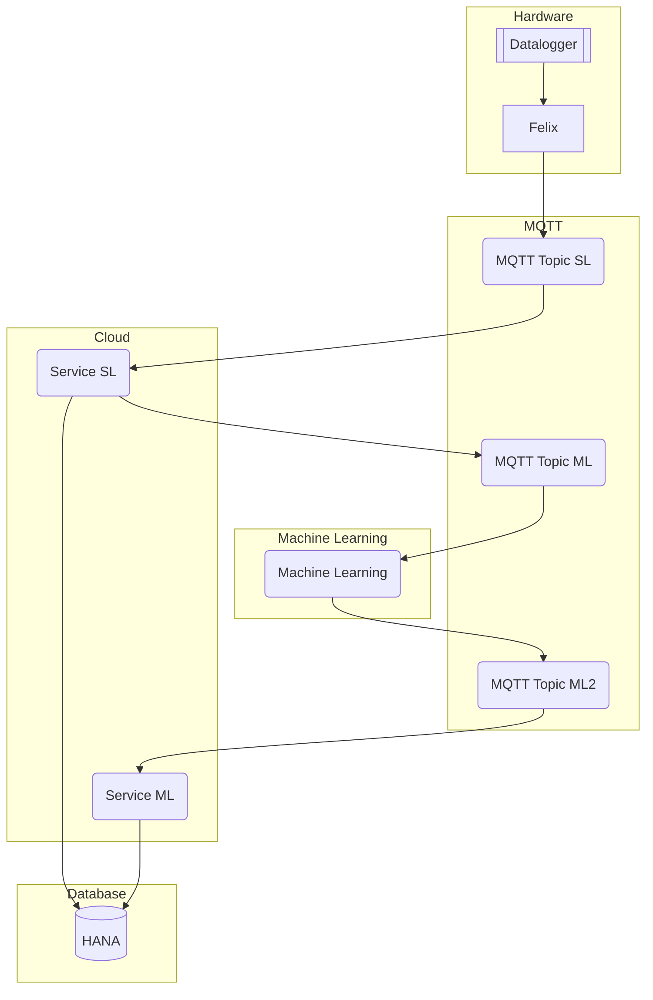
```mermaid
flowchart TD
    subgraph Hardware
        dl[[Datalogger]] 
        Felix
    end
    subgraph MQTT
        msl(MQTT Topic SL)
        mml(MQTT Topic ML)
        mml2(MQTT Topic ML2)
    end
    subgraph Cloud
        ssl(Service SL)
        sml(Service ML)
    end
    subgraph Database
        hana[(HANA)]
    end
    subgraph "Machine Learning"
        ml(Machine Learning)
    end
    dl --> Felix --> msl --> ssl --> hana & mml
    mml --> ml --> mml2 --> sml --> hana
```

Andere Richtungen wären
    `TB` ==T==op to ==B==ottom
    `TD` ==T==op-==D==own
    `BT` ==B==ottom to ==T==op
    `RL` ==R==ight to ==L==eft
    `LR` ==L==eft to ==R==ight

### Andere Darstellungen und Id's für die Bezeichner
- Kürzere Schreibweisen zum ansprechen von Verbindungen (siehe: Doppelt -> Ecken, Ende-Zeile 1):
- Inhalte mit Leerzeichen (nicht mit \_)
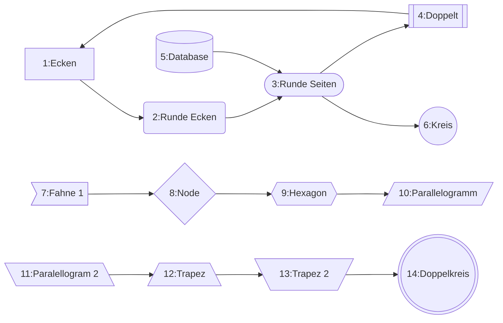
```mermaid
flowchart LR
    id1[1:Ecken] --> id2(2:Runde Ecken) --> id3([3:Runde Seiten]) --> id4[[4:Doppelt]] --> id1
    id5[(5:Database)] --> id3 --> id6((6:Kreis))
    id7>7:Fahne 1] --> id8{8:Node} --> id9{{9:Hexagon}} --> id10[/10:Parallelogramm/]
    id11[\11:Paralellogram 2\] --> id12[/12:Trapez\] --> id13[\13:Trapez 2/] --> id14(((14:Doppelkreis)))
```

```
id1[Ecken]
id2(Runde Ecken)
id3([Runde Seiten])
id4[[Doppelt]]
id5[(Database)]
id6((Kreis))
id7>Fahne 1]
id8{Node}
id9{{Hexagon}}
id10[/Parallelogramm/]
id11[\Paralellogram 2\]
id12[/Trapez\]
id13[\Trapez 2/]
id14(((Doppelkreis)))
```

### Verbindungen
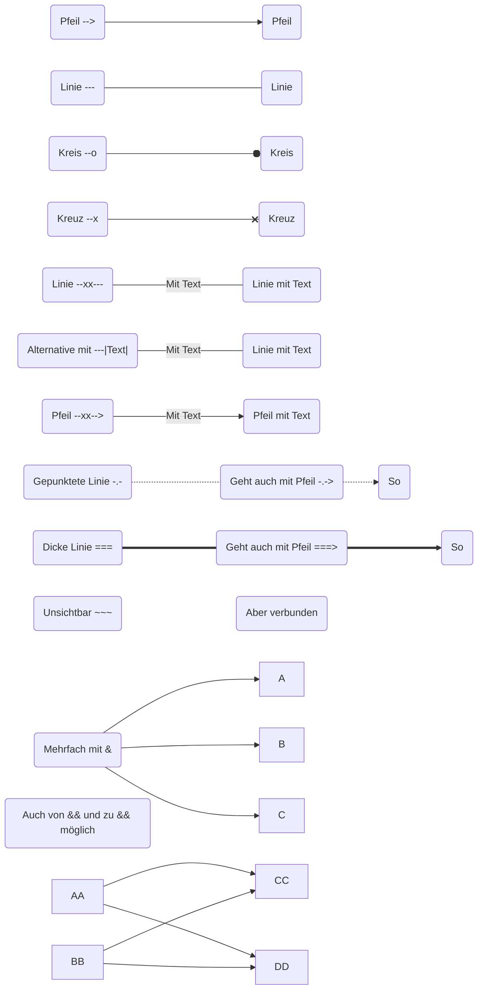
```mermaid
flowchart LR
    id1("Pfeil -->") --> id2("Pfeil")
    id3("Linie ---") --- id4("Linie")
    id21("Kreis --o") --o id22("Kreis")
    id23("Kreuz --x") --x id24("Kreuz")
    id5("Linie --xx---") -- Mit Text --- id6("Linie mit Text")
    id7("Alternative mit ---|Text|") ---|Mit Text| id8("Linie mit Text")
    id9("Pfeil --xx-->") -- Mit Text --> id10("Pfeil mit Text")
    id11("Gepunktete Linie -.-") -.- id12("Geht auch mit Pfeil -.->") -.-> id13("So")
    id14("Dicke Linie ===") === id15("Geht auch mit Pfeil ===>") ===> id16("So")
    id17("Unsichtbar ~~~") ~~~ id18("Aber verbunden")
    id19("Mehrfach mit &") --> A & B & C
    id20("Auch von && und zu && möglich")
    AA & BB --> CC & DD
```

Mehrfachverbindungen (Pfeil < >, Kreis o, Kreuz x am Anfang UND Ende)
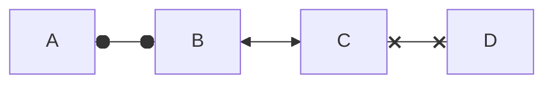
```mermaid
    flowchart LR
    A o--o B
    B <--> C
    C x--x D
```
### Unterdiagramme
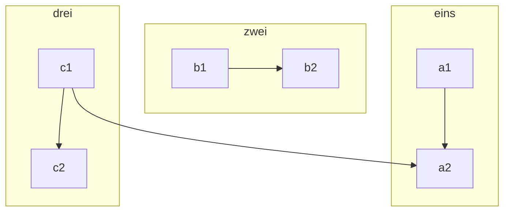
```mermaid
flowchart TD
    c1 --> a2
    subgraph eins
    a1 --> a2
    end
    subgraph zwei
    b1 --> b2
    end
    subgraph drei
    c1 --> c2
    end
```

Ein subgraph muss nicht vor einem neuen subgraph beendet werden: Alle `end` am Ende:

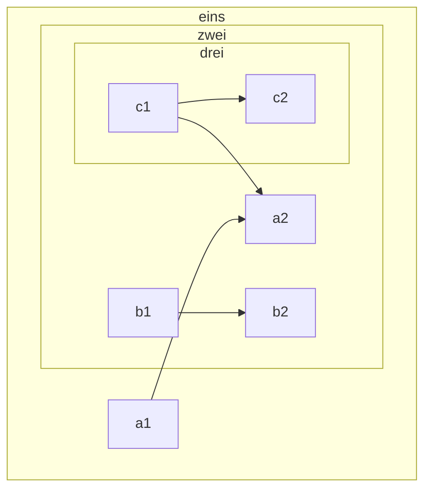
```mermaid
flowchart TD
    subgraph eins
    a1 --> a2
    subgraph zwei
    c1 --> a2
    b1 --> b2
    subgraph drei
    c1 --> c2
    end
    end
    end
```

Es können auch Verbindungen zu subgraph anstelle von Elementen angezeigt werden:
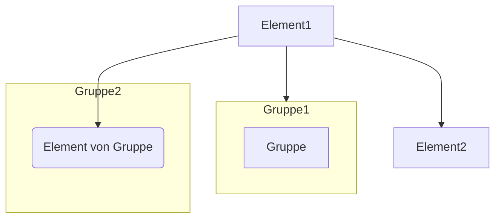
```mermaid
flowchart TD
    Element1 --> Element2 & Gruppe1 & e
    subgraph Gruppe1
        Gruppe
    end
    subgraph Gruppe2
        e(Element von Gruppe)
    end
```
### Verwendung von Markdown innerhalb des Charts
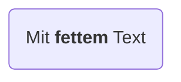
```mermaid
flowchart TD
    a("`Mit **fettem** Text`")
```


## Weitere Diagrammtypen (kurz gezeigt)

### Sequenzdiagramm
[mermaid.js.org](http://mermaid.js.org/syntax/sequenceDiagram.html)

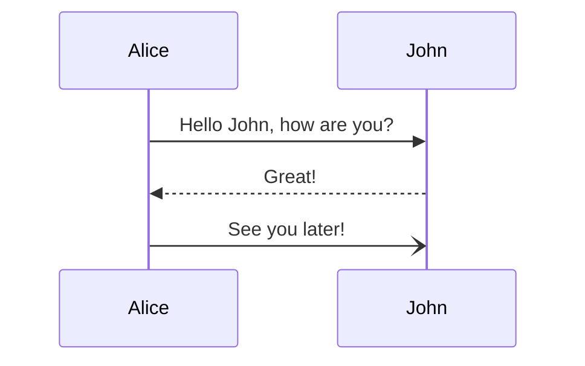
```mermaid
sequenceDiagram
    Alice->>John: Hello John, how are you? 
    John-->>Alice: Great!
    Alice-)John: See you later!
```

### Klassendiagramm
[mermaid.js.org](http://mermaid.js.org/syntax/classDiagram.html)
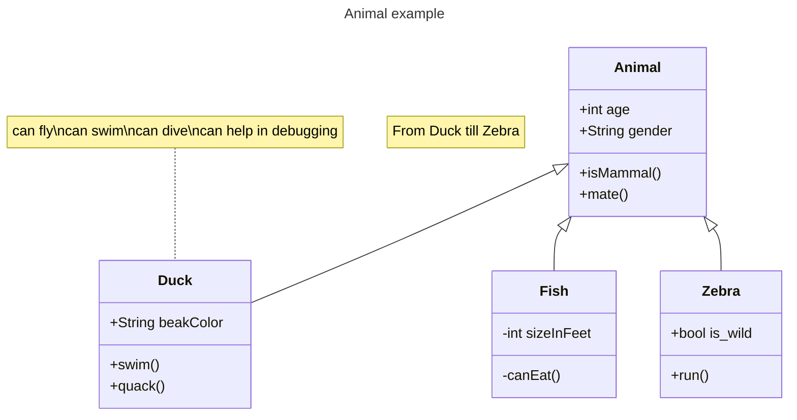
```mermaid
---
title: Animal example
---
classDiagram
    note "From Duck till Zebra"
    Animal <|-- Duck
    note for Duck "can fly\ncan swim\ncan dive\ncan help in debugging"
    Animal <|-- Fish
    Animal <|-- Zebra
    Animal : +int age
    Animal : +String gender
    Animal: +isMammal()
    Animal: +mate()
    class Duck{
        +String beakColor
        +swim()
        +quack()
    }
    class Fish{
        -int sizeInFeet
        -canEat()
    }
    class Zebra{
        +bool is_wild
        +run()
    }
```

### Entity Relationship Model (ERM)
[mermaid.js.org](http://mermaid.js.org/syntax/entityRelationshipDiagram.html)
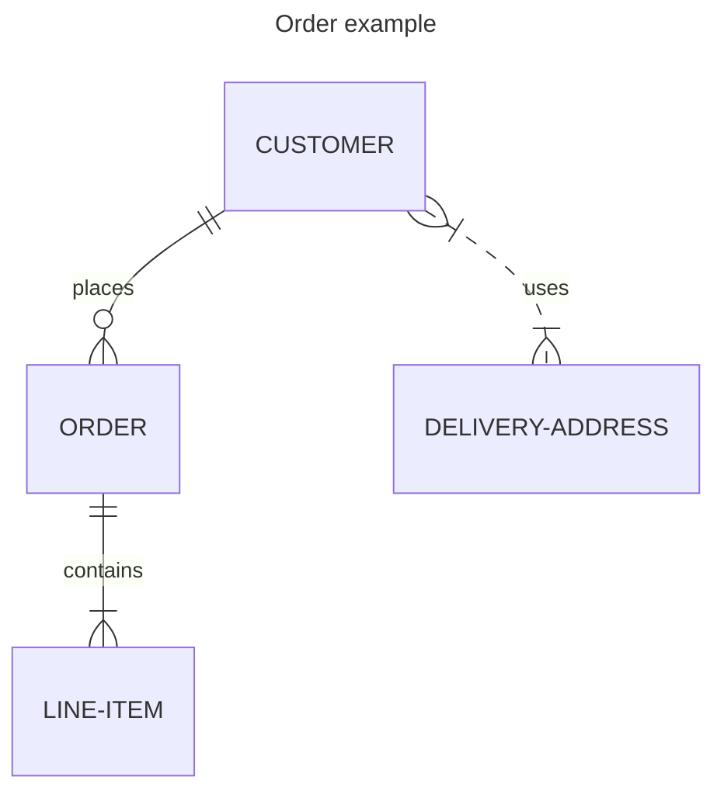
```mermaid
---
title: Order example
---
erDiagram
    CUSTOMER ||--o{ ORDER : places
    ORDER ||--|{ LINE-ITEM : contains
    CUSTOMER }|..|{ DELIVERY-ADDRESS : uses
```

### User Journeys
[mermaid.js.org](http://mermaid.js.org/syntax/userJourney.html)
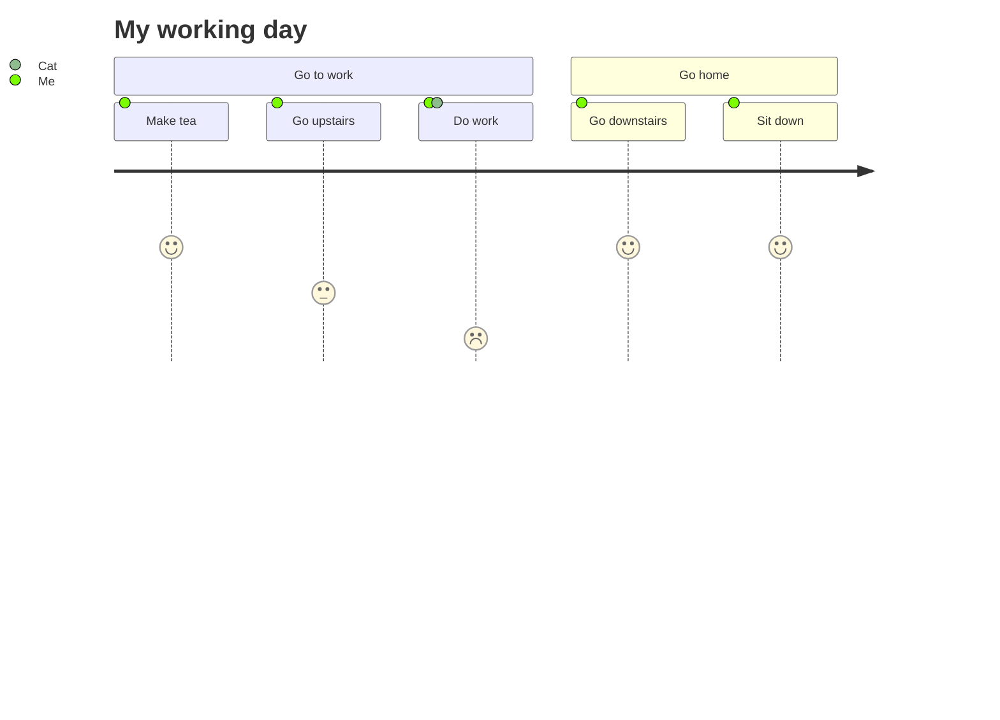
```mermaid
journey
    title My working day
    section Go to work
      Make tea: 5: Me
      Go upstairs: 3: Me
      Do work: 1: Me, Cat
    section Go home
      Go downstairs: 5: Me
      Sit down: 5: Me
```

### Gantt
[mermaid.js.org](http://mermaid.js.org/syntax/gantt.html)
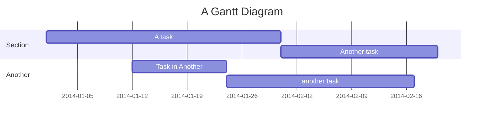
```mermaid
gantt
    title A Gantt Diagram
    dateFormat YYYY-MM-DD
    section Section
        A task          :a1, 2014-01-01, 30d
        Another task    :after a1, 20d
    section Another
        Task in Another :2014-01-12, 12d
        another task    :24d
```

### Pie Chart
[mermaid.js.org](http://mermaid.js.org/syntax/pie.html)

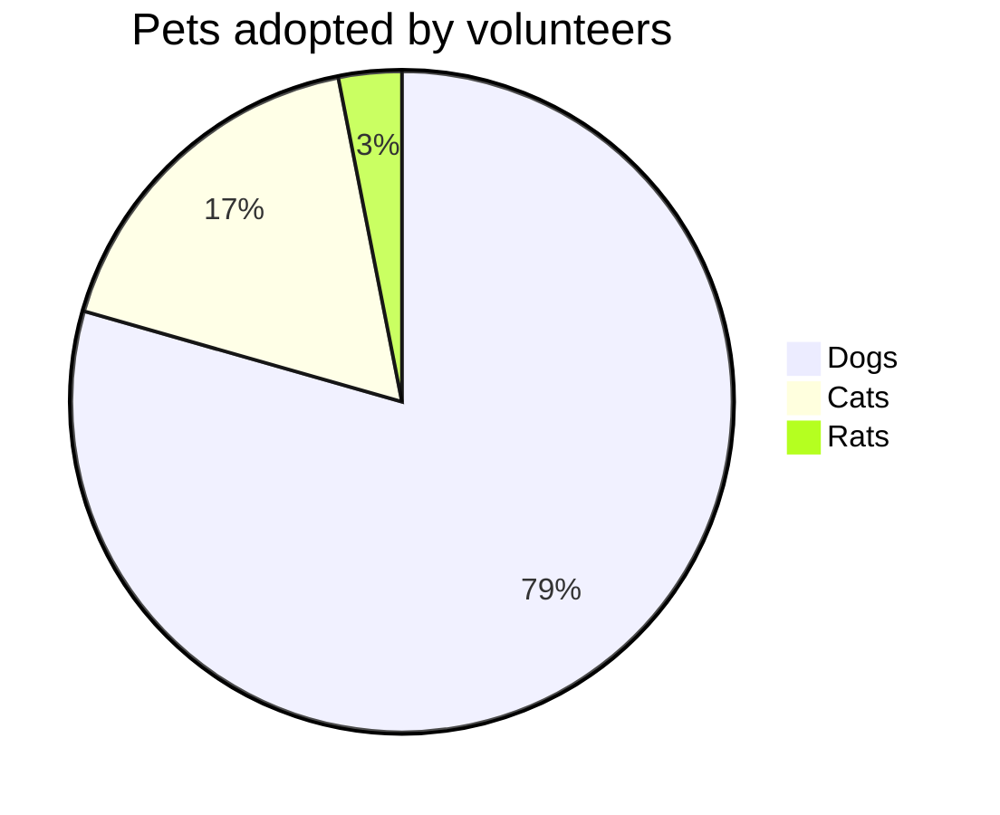
```mermaid
pie title Pets adopted by volunteers
    "Dogs" : 386
    "Cats" : 85
    "Rats" : 15
```


### Quadrant Chart
[mermaid.js.org](http://mermaid.js.org/syntax/quadrantChart.html)

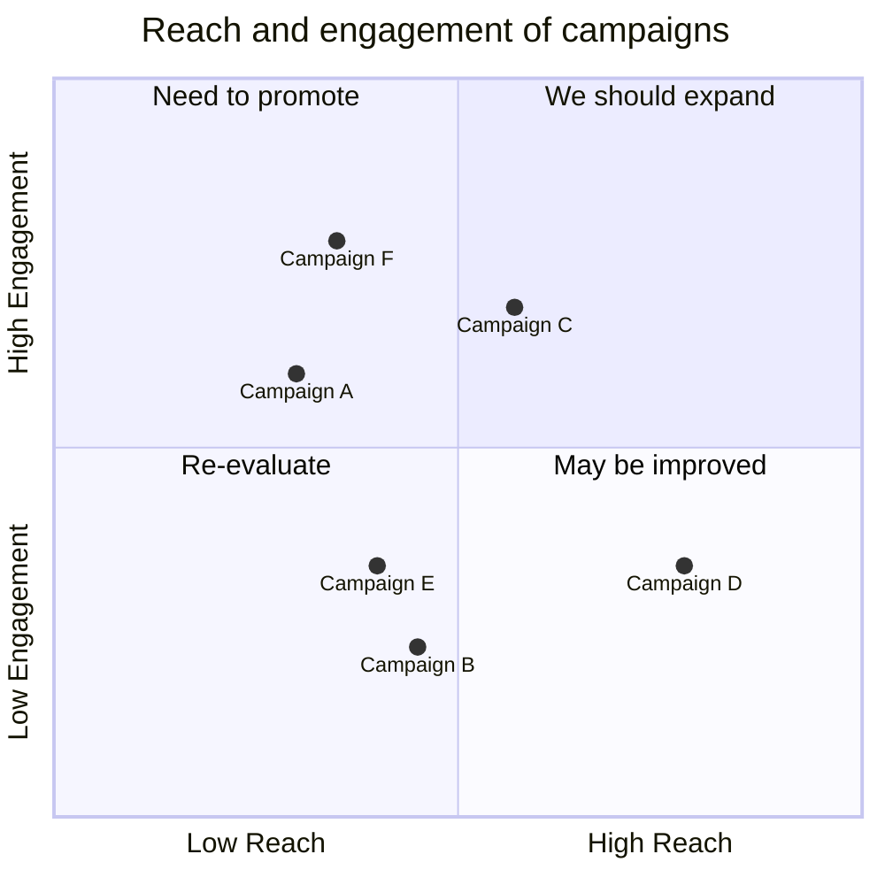
```mermaid
quadrantChart
    title Reach and engagement of campaigns
    x-axis Low Reach --> High Reach
    y-axis Low Engagement --> High Engagement
    quadrant-1 We should expand
    quadrant-2 Need to promote
    quadrant-3 Re-evaluate
    quadrant-4 May be improved
    Campaign A: [0.3, 0.6]
    Campaign B: [0.45, 0.23]
    Campaign C: [0.57, 0.69]
    Campaign D: [0.78, 0.34]
    Campaign E: [0.40, 0.34]
    Campaign F: [0.35, 0.78]
```

### Gitgraph (Git) Diagram
ID Angaben sind optional, ohne werden Zufalls-IDs erstellt
[mermaid.js.org](http://mermaid.js.org/syntax/gitgraph.html)
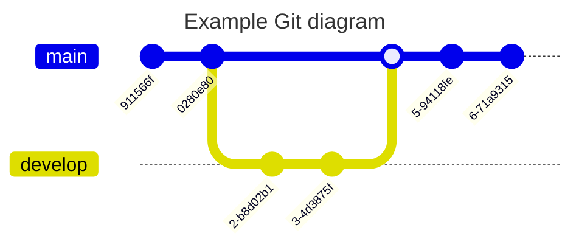
```mermaid
---
title: Example Git diagram
---
gitGraph
   commit id: "911566f"
   commit id: "0280e80"
   branch develop
   checkout develop
   commit
   commit
   checkout main
   merge develop
   commit
   commit
```
### C4 Diagramm
[mermaid.js.org](http://mermaid.js.org/syntax/c4.html)
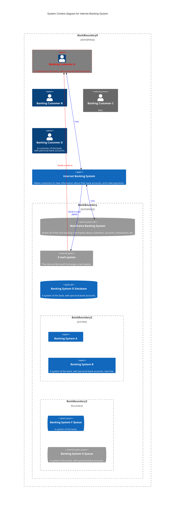
```mermaid
C4Context
      title System Context diagram for Internet Banking System
      Enterprise_Boundary(b0, "BankBoundary0") {
        Person(customerA, "Banking Customer A", "A customer of the bank, with personal bank accounts.")
        Person(customerB, "Banking Customer B")
        Person_Ext(customerC, "Banking Customer C", "desc")

        Person(customerD, "Banking Customer D", "A customer of the bank, <br/> with personal bank accounts.")

        System(SystemAA, "Internet Banking System", "Allows customers to view information about their bank accounts, and make payments.")

        Enterprise_Boundary(b1, "BankBoundary") {

          SystemDb_Ext(SystemE, "Mainframe Banking System", "Stores all of the core banking information about customers, accounts, transactions, etc.")

          System_Boundary(b2, "BankBoundary2") {
            System(SystemA, "Banking System A")
            System(SystemB, "Banking System B", "A system of the bank, with personal bank accounts. next line.")
          }

          System_Ext(SystemC, "E-mail system", "The internal Microsoft Exchange e-mail system.")
          SystemDb(SystemD, "Banking System D Database", "A system of the bank, with personal bank accounts.")

          Boundary(b3, "BankBoundary3", "boundary") {
            SystemQueue(SystemF, "Banking System F Queue", "A system of the bank.")
            SystemQueue_Ext(SystemG, "Banking System G Queue", "A system of the bank, with personal bank accounts.")
          }
        }
      }

      BiRel(customerA, SystemAA, "Uses")
      BiRel(SystemAA, SystemE, "Uses")
      Rel(SystemAA, SystemC, "Sends e-mails", "SMTP")
      Rel(SystemC, customerA, "Sends e-mails to")

      UpdateElementStyle(customerA, $fontColor="red", $bgColor="grey", $borderColor="red")
      UpdateRelStyle(customerA, SystemAA, $textColor="blue", $lineColor="blue", $offsetX="5")
      UpdateRelStyle(SystemAA, SystemE, $textColor="blue", $lineColor="blue", $offsetY="-10")
      UpdateRelStyle(SystemAA, SystemC, $textColor="blue", $lineColor="blue", $offsetY="-40", $offsetX="-50")
      UpdateRelStyle(SystemC, customerA, $textColor="red", $lineColor="red", $offsetX="-50", $offsetY="20")

      UpdateLayoutConfig($c4ShapeInRow="3", $c4BoundaryInRow="1")
```

### Mindmaps
[mermaid.js.org](http://mermaid.js.org/syntax/mindmap.html)
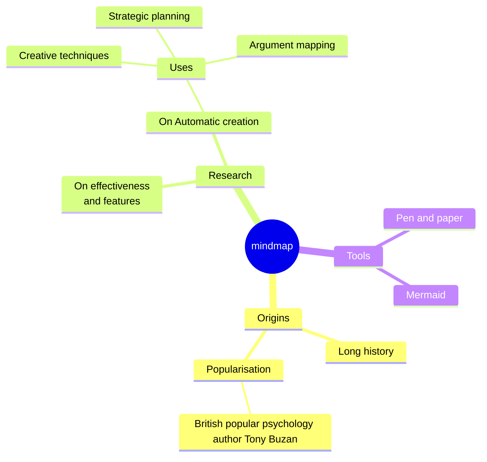
```mermaid
mindmap
  root((mindmap))
    Origins
      Long history
      ::icon(fa fa-book)
      Popularisation
        British popular psychology author Tony Buzan
    Research
      On effectiveness<br/>and features
      On Automatic creation
        Uses
            Creative techniques
            Strategic planning
            Argument mapping
    Tools
      Pen and paper
      Mermaid
```

### Timeline
[mermaid.js.org](http://mermaid.js.org/syntax/timeline.html)
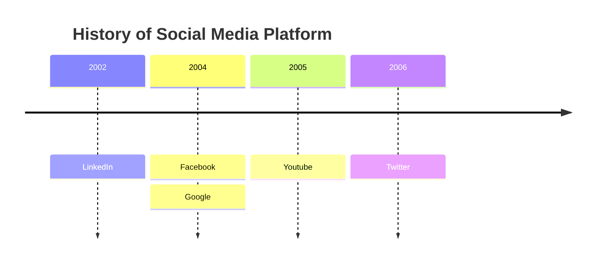
```mermaid
timeline
    title History of Social Media Platform
    2002 : LinkedIn
    2004 : Facebook
         : Google
    2005 : Youtube
    2006 : Twitter
```
# Noch mehr

[[Kanban]]
